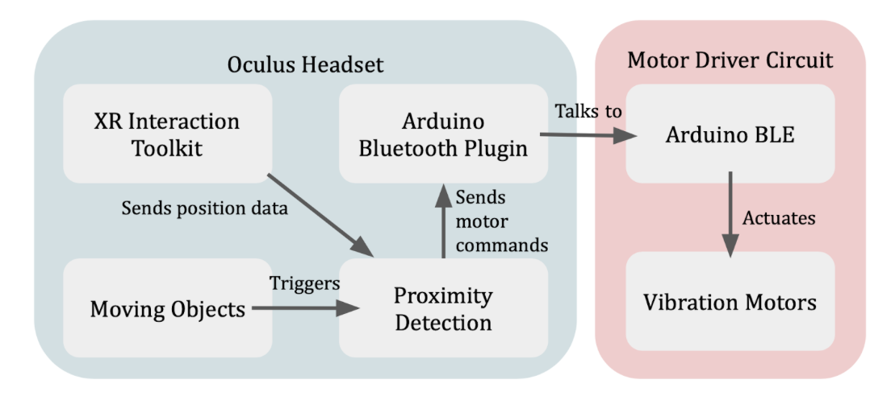

# VR-Better
Uses haptic feedback to address Visually Induced Motion Sickness (VIRS) in VR. 

by Tony Fu, Sivathanu Kumar, Hon Keat Chan

## Introduction

In this project, we propose a solution to counteract the nausea often experienced by Virtual Reality (VR) users, a consequence of a lack of intuitive awareness within their virtual environments. Our approach employs tactile stimuli, conveyed through subtle vibrations from small motors mounted behind the user's ears. These signals guide user attention towards specific areas within the VR environment, which in turn reduces the need for VR content creators to rotate their scenes—a common cause of user discomfort and sickness.

Our system is not exclusive to VR environments; it also offers benefits in real-world settings. Owing to the immersive nature of VR, users can frequently lose awareness of their actual surroundings, potentially putting themselves at risk. Our solution addresses this issue by using lighted indicators that simultaneously signal to bystanders about the user's presence or intended direction. Additionally, the device is equipped with sensors that capture and log data from the built-in accelerometer and gyroscope, providing users with the opportunity to adjust the intensity of the vibration motors. This approach enhances both user safety and the overall VR experience.

## Design

The project undergoes three design iterations. Our initial prototype was developed on a breadboard, employing an Arduino Nano 33 BLE for control of four small vibration motors through BJT circuits (**Figure 1**). Two of these motors were designed with malleable steel wires for convenient ear mounting. This first prototype successfully established communication with a Quest 2 headset using the [Arduino Bluetooth Plugin](https://assetstore.unity.com/packages/tools/input-management/arduino-bluetooth-plugin-98960#description) from Unity Asset Store (**Figure 2**).

**Figure 1**: Initial Prototype. This image depicts our initial prototype, constructed using a breadboard. It incorporates an Arduino Nano 33 BLE, which independently controls each small motor through a BJT circuit. The four vibration motors, denoted by the cyan box, include two that come equipped with malleable steel wires for mounting behind the user's ears. This prototype successfully establishes communication with the Quest 2 headset, enabling transmission of motor commands.

**Figure 2**: Block Diagram of Initial Prototype. This diagram provides an overview of the initial prototype's architecture. The Oculus Headset houses an application developed using Unity, utilizing the XR Interaction Toolkit to facilitate integration with the VR headset (for instance, obtaining the position of the headset). Virtual objects of interest are tagged; when these objects come within five units of virtual distance from the user's virtual camera, they activate the proximity detection component. This element calculates the suitable intensity for the four motors (up, down, left, right) based on the relative position of the object to the user. Subsequently, the Arduino Bluetooth Plugin communicates with the Motor Driver Circuit, which actuates the vibration motors as needed.

For the second prototype, we transitioned to a custom PCB design, powered by a single coin cell battery (**Figure 3**). We incorporated capacitors to stabilize the current; however, the coin cell battery was insufficient in supplying the necessary current for the motors.

**Figure 3**: Second Prototype. Our customized second prototype is designed with a PCB and powered by a single coin cell battery. In an attempt to stabilize the current, we incorporated some capacitors into the design. However, we encountered an issue where the coin cell battery was insufficient in providing the necessary current to operate the motors.

Based on our experience with the first two prototypes, our third iteration combined ultrasound rangefinders with vibration motors and LED lights. The updated design aimed to alert users about both the virtual and real objects around them and signal their probable direction of movement to observers. **Figure 4** shows the physical architecture of the VRbetter augmentation device. The same design is intended to:

1. In VR environments, provide a Bluetooth channel from the CPU driving the virtual environment to a pair of vibration motors mounted behind the ears of the VR user to alert the user to ‘happenings’ behind the user within the virtual environment. This negates the need for the user inhabiting the virtual environment having the need to keep looking as the user currently gets little to no hints as one would in the real world.
2. In the real world, senses for approaching objects from behind the user, simultaneously provide lighted indicators to signal to the approaching party of the presence or intended direction of the user, and provide the user enhanced awareness of the distance and or approaching speed towards the user from the back via a pair of vibration motors mounted to the back of the user’s ears. It may be used as a personal safety for joggers or bicyclists.  
3. Capture and log accelerometer and gyroscope data from the built in IMU to allow the user to acknowledge or ‘tone-down’ the intensity of the vibration motors.
4. With additional sensors to the front, provide a visually impaired user a means to detect obstacles.

The device is currently powered from a ubiquitous USB power pack probably most conveniently mounted in a pocket at the lower back of the user as is commonly found in bicyclist or jogger apparel.

**Figure 4**: VRbetter Hardware Schematic. This diagram details the configuration of the VRbetter device. At the heart of the system, the Arduino Nano 33 BLE processes inputs from two ultrasound rangefinders. It then outputs instructions to two vibration motors and 12 red LEDs (6 per side) via the 16-channel PCA 9685 PWM controller.

**Figure 5**: VRbetter hardware mounted on the back of the Oculus Quest Pro virtual reality headset. Vibration motors are tucked into the fabric headband behind the ears of the mannequin.

**Figure 6**: Side view of **Figure 5**.

**Figure 7**: View again from the back. Note the LEDs and PWM driver are mounted on a velcro strip to be mounted to the back of the shoulders of the user.

## Early Results

Our initial experiments involved attaching vibration motors insecurely to the back of the ears and the forehead. These setups demonstrated that even when a motor was weakly activated without the wearer's awareness, it could prompt a response to move the head in the direction of the vibration. For instance, as depicted in **Figure 8**, the activation of the left motor (represented in green) occasionally incited a leftward turn from the user (blue line).

However, these responses did not demonstrate a linear correlation, with the user's response and the motor's intensity showing no clear relationship. In particular, the right motor's attachment was insufficient, leading to the user having difficulty sensing its vibration (red line in **Figure 8**).

**Figure 8**: Example trial of user response to tactile stimulation. The plot displays the y-axis gyroscope readings (in arbitrary units) alongside the corresponding left and right motor intensities. The angular velocity (blue line) represents the readings from the gyroscope. The green and red lines indicate the intensities of the left and right motors, respectively. 

Another challenge we encountered was the inconsistent quality of electrical connections to the motors, likely due to the breadboard nature of our wiring. To address these issues, we aimed to develop more secure setups. However, our efforts were cut short by time constraints before we could conduct more advanced experimentation.

We developed a simple VR game as a testing ground for the communication between the motor driving circuit and the Oculus headset. The game is designed with a single moving object that rotates counterclockwise around the player (**Figure 9**). The game actuates the motors depending on the sphere's relative position to the player's head. Anecdotal evidence from the test subject suggested he could discern the ball's left or right position based on the tactile cues received from the VR device.

**Figure 9**: Top-Down View of a Simple VR Testing Game. In the center is the user standing on a green platform. A yellow ball rotates counterclockwise around the user, serving as the stimulus for activating the left and right vibration motors. These motors communicate the position of the moving sphere relative to the user, enhancing spatial awareness within the VR environment.

## Continuing Work
* Our current model utilizes the HC-SR04 ultrasonic sensor with a limited range of 13ft. However, we are exploring the integration of a Time-of-Flight (ToF) sensor, specifically the VL53L4CX. By mounting this on a custom PCB with an identical pinout, we could potentially detect objects up to 3m away.
* We are also working on a custom printed circuit board for the CPU and IMU. This improved model would feature expanded non-volatile memory for more robust data logging capabilities.
* To aid visually impaired users, we aim to add ranging and other types of sensors to the front of the device.
* Continuous development is underway to enhance the software that interfaces with VR games and environment.
